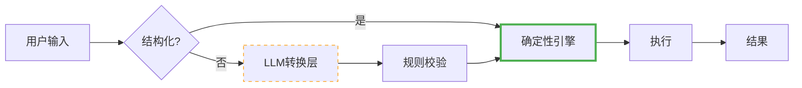

## LLM工具选用的理性决策框架

> **核心原则**：**LLM处理「模糊的正确」，程序处理「精确的正确」**  
> 通用工具的基石必须是**确定性算法**，LLM仅作为**可选增强层**。

---

### 一、何时用LLM？—— 三类高价值场景

| 场景类型     | 特征                     | 示例                                          | 价值密度 |
| ------------ | ------------------------ | --------------------------------------------- | -------- |
| **语义转换** | 自然语言 ↔ 结构化规则    | "生成北京用户" → `{city: "北京", count: 100}` | ⭐⭐⭐ 高   |
| **开放生成** | 无唯一正确答案，需多样性 | 生成产品描述、测试用例标题                    | ⭐⭐ 中    |
| **知识推理** | 依赖外部知识库的模糊推理 | "类似React的轻量框架" → Svelte/Preact         | ⭐⭐ 中    |

✅ **共性**：任务**无精确约束**，失败可容忍，人类难以规模化完成。

---

### 二、何时禁用LLM？—— 四类反模式

| 反模式            | 本质问题                   | 后果                    | 替代方案                  |
| ----------------- | -------------------------- | ----------------------- | ------------------------- |
| **结构化逻辑**    | 外键/约束/算法是确定性问题 | 主键冲突、循环依赖误判  | 元数据反射 + 拓扑排序     |
| **精确约束遵守**  | 唯一性/类型/范围需100%保证 | 违反DB约束，插入失败    | 本地校验 + 重试机制       |
| **高频/批量操作** | 每次调用有秒级延迟         | 10万行生成从20秒→10分钟 | 批量本地生成（5,000+/秒） |
| **敏感数据处理**  | 表结构/代码外传至第三方    | 违反GDPR/内网安全策略   | 纯本地执行，零数据外泄    |

❌ **共性**：任务有**精确约束**，失败不可接受，或涉及安全/性能关键路径。

---

### 三、决策自查清单（5秒判断）

在引入LLM前，自问：

| 问题                            | 答"是" → 可考虑LLM   | 答"否" → 用确定性算法      |
| ------------------------------- | -------------------- | -------------------------- |
| 1. 任务是否有**唯一正确答案**？ | 否（如"写一段文案"） | 是（如"计算外键依赖顺序"） |
| 2. 失败是否**可自动降级**？     | 是（降级到默认值）   | 否（导致系统崩溃）         |
| 3. 是否必须**离线/内网**运行？  | 否（有稳定外网）     | 是（工控/金融环境）        |
| 4. 延迟是否**<100ms**？         | 否（秒级可接受）     | 是（实时交互场景）         |

> ✅ **通过全部"否" = 禁用LLM**  
> ⚠️ **任一"是" = 仅作为可选增强层，且必须有降级策略**

---

### 四、架构黄金法则

- **✅ 核心引擎**：100%确定性算法（无LLM）
- **⚠️ LLM层**：仅用于**输入预处理**，输出必须经**规则校验**后才进入核心
- **🚫 禁止**：LLM直接生成代码/SQL/配置文件并执行

---

### 五、风险-价值矩阵

|                                 | **高价值**                                 | **低价值**                                     |
| ------------------------------- | ------------------------------------------ | ---------------------------------------------- |
| **低风险** （离线可降级）    | ✅ 优先使用 • 语义搜索增强 • 文档摘要 | ⚠️ 谨慎评估ROI • 自动生成注释                |
| **高风险** （需联网/无降级） | 🚫 严格限制 • 仅用于演示/原型            | ❌ 禁止使用 • 核心数据生成 • 安全关键路径 |

> 💡 **风险维度**：稳定性 × 性能 × 安全 × 合规 × 成本  
> 💡 **价值维度**：不可替代性 × 用户体验提升 × 人工节省

---

### 六、终极建议

| 角色         | 行动指南                                              |
| ------------ | ----------------------------------------------------- |
| **架构师**   | 设计时默认**无LLM**，仅在用户体验层提供"智能增强"开关 |
| **工程师**   | 核心逻辑100%单元测试覆盖；LLM输出必须经Schema校验     |
| **产品经理** | 不承诺"AI生成"，承诺"规则驱动+可选智能辅助"           |
| **安全官**   | 禁止LLM接触生产数据/敏感Schema；内网环境默认禁用      |

> 🌟 **记住**：  
> - **LLM是「副驾驶」，不是「自动驾驶」**  
> - **工具的可靠性 > 智能感**  
> - **当不确定时，选择确定性方案**